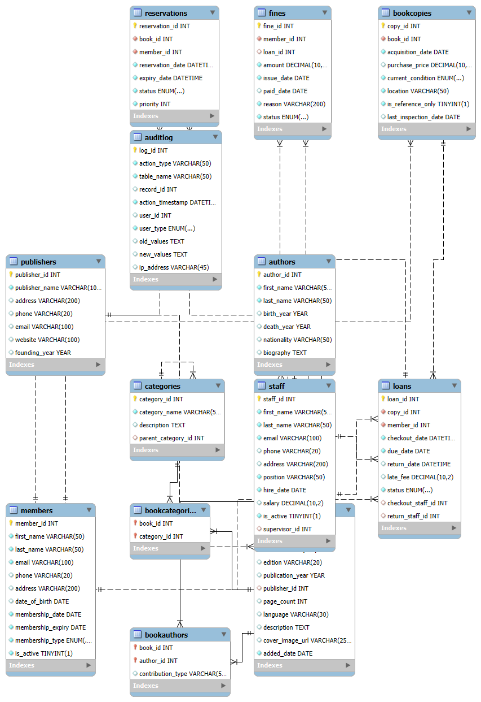

# 📚 Library Management System - Database Schema



## Project Description
A complete MySQL database for library management systems with:
- Member management
- Book cataloging
- Loan tracking
- Reservation system
- Fine calculation

## Database✨ Features

- **Full relational schema** with 12 normalized tables
- **Multi-user support** (Members, Staff, Admin roles)
- **Loan management** with due dates, renewals, and fines
- **Inventory tracking** for book copies across locations
- **Search optimization** with indexed fields
- **Audit logging** for all critical operations

## 🛠️ Technical Specifications

| Component       | Details                                                                 |
|-----------------|-------------------------------------------------------------------------|
| Database Engine | MySQL 8.0+                                               |
| Schema          | 45+ columns across 12 tables                                            |
| Constraints     | Primary/Foreign Keys, CHECK, UNIQUE, NOT NULL                          |
| Relationships   | 1:1, 1:Many, Many:Many (via junction tables)                           |
| Indexes         | Optimized for common queries (member lookups, book searches, loan tracking) |

  
## Setup Instructions

1. **Requirements**:
   - MySQL 8.0+
   - MySQL Workbench (recommended)

2. **Import the database**:
   ```bash
   mysql -u username -p < library_db.sql
